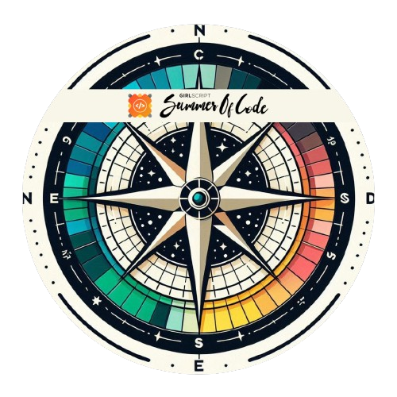

<h1 align="center"> Hello Universe, I'm <a href="https://github.com/Soumyadipgithub">Soumyadip Giri</a> </h1>

 

### ✨ Passionate CSE Engineer | Web, App, CMS & AI Developer
🚀 Problem Solver | Curious from Hardware to the AI Era

I am a computer science engineer who believes that software is, at its core, simply a solution to a business problem. My journey started as a kid opening up PC cabinets just to see what was inside, and that same curiosity drives me today to understand the "behind the scenes" of modern tech—especially in the fast-paced AI era.

🔭 Currently working on: Building robust Web and App solutions, developing custom CMS architectures, and integrating AI-based solutions to solve real-world problems.

🌱 Learning: GenAI, Agentic AI, local models, and expanding my knowledge across the entire Software Development Life Cycle (SDLC).

📫 How to reach me: <a href="https://linkedin.com/in/soumyadip-giri-k">LinkedIn</a> (Always open to connecting—I'm sure I can learn something from you!)

👯 Open to collaborating on: Innovative web/app projects, AI integrations, and hackathons.

💬 Ask me about: Web & App Development, CMS customization, APIs, and AI trends.

⚡ Fun fact: And yes, I am also just one line of code in this cosmos, still running and executing!

📰 My Story: <a href="https://soumyadipgiri.medium.com/hello-world-from-opening-pc-cabinets-to-solving-real-world-problems-a27fc54815a1">From Opening PC Cabinets to Solving Real-World Problems</a>
---

<b>🛠 Tech Stack</b>  
Languages: 
 
 
 
 
 

Platforms & Tools: 

## Certification Badges 🪶

  
  
  
  

<b>🏆 GSSOC(24) Badges</b>

  
  
  
  
  
  

<b>📊 GitHub Analytics & Activity Dashboard</b>

 

  

 

  <table border="0">
    <tr>
      <td>
        
      </td>
      <td>
        
      </td>
    </tr>
  </table>

  <table border="0">
    <tr>
      <td>
        
      </td>
      <td>
        
      </td>
    </tr>
  </table>

<b>🏅 GitHub Trophies</b>

  

## 📦 Featured Works

  
  &nbsp;&nbsp;&nbsp;&nbsp;&nbsp;&nbsp;&nbsp;&nbsp;&nbsp;&nbsp;&nbsp;&nbsp;
  

  <b>GKV N0tes 2.0</b> &nbsp;&nbsp;&nbsp;&nbsp;&nbsp;&nbsp;&nbsp;&nbsp;&nbsp;&nbsp;&nbsp;&nbsp;&nbsp;&nbsp;&nbsp;&nbsp;&nbsp;&nbsp;&nbsp;&nbsp;&nbsp;&nbsp;&nbsp;&nbsp;&nbsp; <b>VibeSyntax</b>
   
  <i>Education App</i> &nbsp;&nbsp;&nbsp;&nbsp;&nbsp;&nbsp;&nbsp;&nbsp;&nbsp;&nbsp;&nbsp;&nbsp;&nbsp;&nbsp;&nbsp;&nbsp;&nbsp;&nbsp;&nbsp;&nbsp; <i>VS Code Extension</i>

  
  &nbsp;
  

---

  &nbsp;&nbsp;

  &nbsp;&nbsp;

  &nbsp;&nbsp;

  &nbsp;&nbsp;

  
   
<b>Show some ❤️ by starring some of the repositories!</b>

  

